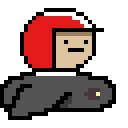

<!-- Improved compatibility of back to top link: See: https://github.com/othneildrew/Best-README-Template/pull/73 -->

<!--
*** Thanks for checking out the Best-README-Template. If you have a suggestion
*** that would make this better, please fork the repo and create a pull request
*** or simply open an issue with the tag "enhancement".
*** Don't forget to give the project a star!
*** Thanks again! Now go create something AMAZING! :D
-->

<!-- PROJECT SHIELDS -->
<!--
*** I'm using markdown "reference style" links for readability.
*** Reference links are enclosed in brackets [ ] instead of parentheses ( ).
*** See the bottom of this document for the declaration of the reference variables
*** for contributors-url, forks-url, etc. This is an optional, concise syntax you may use.
*** https://www.markdownguide.org/basic-syntax/#reference-style-links
-->
[![Contributors][contributors-shield]][contributors-url]
[![Forks][forks-shield]][forks-url]
[![Stargazers][stars-shield]][stars-url]
[![Issues][issues-shield]][issues-url]
[![MIT License][license-shield]][license-url]
[![LinkedIn][linkedin-shield]][linkedin-url]

<!-- PROJECT LOGO -->
 

  

  <h3 align="center">Nom Nom 2020</h3>

  

    Small university project game made in 2020 by <a href="https://github.com/AitorAstorga">Aitor Astorga Saez de Vicuña</a> and <a href="https://github.com/danmazkih">Danel Mazkiaran Hernandez</a>
     
    <a href="https://github.com/AitorAstorga/Nom-Nom-2020"><strong>Explore the docs »</strong></a>
     
     
    <a href="https://github.com/AitorAstorga/Nom-Nom-2020">View Demo</a>
    ·
    <a href="https://github.com/AitorAstorga/Nom-Nom-2020/issues">Report Bug</a>
    ·
    <a href="https://github.com/AitorAstorga/Nom-Nom-2020/issues">Request Feature</a>
  

<!-- TABLE OF CONTENTS -->

  
Table of Contents

  <ol>
    <li>
      <a href="#about-the-project">About The Project</a>
      <ul>
        <li><a href="#built-with">Built With</a></li>
      </ul>
    </li>
    <li>
      <a href="#getting-started">Getting Started</a>
      <ul>
        <li><a href="#prerequisites">Prerequisites</a></li>
        <li><a href="#installation">Installation</a></li>
      </ul>
    </li>
    <li><a href="#usage">Usage</a></li>
    <li><a href="#contributing">Contributing</a></li>
    <li><a href="#license">License</a></li>
    <li><a href="#contact">Contact</a></li>
    <li><a href="#acknowledgments">Acknowledgments</a></li>
  </ol>

<!-- ABOUT THE PROJECT -->
## About The Project

![Product Name Screen Shot][product-screenshot]

This game was developed as a small university project in 2020 (wouldn't have guessed by the title huh :satisfied:). The mechanic is pretty simple: You control Alvaro, a guy in a tiny spaceship who wants to steal coins from different worlds. But the planets will defende themselves, avoid their shots!

Game characteristics:
* Levels are inifinite and dificulty increases with each
* Option to save the game by pressing 's'
* There is a leaderboard with local game points

(<a href="#readme-top">back to top</a>)

### Built With

The thing is built with:

* 
* 
* 

yep, that's it :blush:

(<a href="#readme-top">back to top</a>)

<!-- GETTING STARTED -->
## Getting Started
### Prerequisites

You must have a Windows operating system to play this game. Unfortunately, we were too young and Linux-less when we did this, and we didn't know any better.

Additionally, you will need support for C from Visual Studio. [Install C and C++ support in Visual Studio](https://learn.microsoft.com/en-us/cpp/build/vscpp-step-0-installation?view=msvc-170)

### Installation

To get a local copy up and running follow these simple example steps.

1. Download and unzip the file _[NomNom2020.zip](https://github.com/AitorAstorga/Nom-Nom-2020/releases/tag/1.0.0)_
2. Place the newly created folder in any location you wish
3. Execute _Nom Nom 2020.exe_
* OPTIONAL: you can create a shortcut to your Desktop for easy access to the game!

4. Play!

(<a href="#readme-top">back to top</a>)

<!-- CONTRIBUTING -->
## Contributing

Contributions are what make the open source community such an amazing place to learn, inspire, and create. Any contributions you make are **greatly appreciated**.

If you have a suggestion that would make this better, please fork the repo and create a pull request. You can also simply open an issue with the tag "enhancement".
Don't forget to give the project a star! Thanks again!

1. Fork the Project
2. Create your Feature Branch (`git checkout -b feature/AmazingFeature`)
3. Commit your Changes (`git commit -m 'Add some AmazingFeature'`)
4. Push to the Branch (`git push origin feature/AmazingFeature`)
5. Open a Pull Request

(<a href="#readme-top">back to top</a>)

<!-- LICENSE -->
## License

Distributed under the GNU General Public License v3.0. See `LICENSE` for more information.

(<a href="#readme-top">back to top</a>)

<!-- CONTACT -->
## Contact

Aitor Astorga Saez de Vicuña - a.astorga.sdv@gmail.com
* [![LinkedIn][linkedin-shield]][linkedin-url-aitor]

Danel Mazkiaran Hernandez - danel.mazkiaran@gmail.com
* [![LinkedIn][linkedin-shield]][linkedin-url-danel]

Project Link: [https://github.com/AitorAstorga/Nom-Nom-2020](https://github.com/AitorAstorga/Nom-Nom-2020)

(<a href="#readme-top">back to top</a>)

<!-- ACKNOWLEDGMENTS -->
## Acknowledgments

* [Best-README-Template](https://github.com/othneildrew/Best-README-Template)
* [Choose an Open Source License](https://choosealicense.com)
* [GitHub Emoji Cheat Sheet](https://www.webpagefx.com/tools/emoji-cheat-sheet)
* [Img Shields](https://shields.io)
* [markdown-badges](https://github.com/Ileriayo/markdown-badges#table-of-contents)
* [GitHub Pages](https://pages.github.com)

(<a href="#readme-top">back to top</a>)

<!-- MARKDOWN LINKS & IMAGES -->
<!-- https://www.markdownguide.org/basic-syntax/#reference-style-links -->
[contributors-shield]: https://img.shields.io/github/contributors/AitorAstorga/Nom-Nom-2020.svg?style=for-the-badge
[contributors-url]: https://github.com/AitorAstorga/Nom-Nom-2020/graphs/contributors
[forks-shield]: https://img.shields.io/github/forks/AitorAstorga/Nom-Nom-2020.svg?style=for-the-badge
[forks-url]: https://github.com/AitorAstorga/Nom-Nom-2020/network/members
[stars-shield]: https://img.shields.io/github/stars/AitorAstorga/Nom-Nom-2020.svg?style=for-the-badge
[stars-url]: https://github.com/AitorAstorga/Nom-Nom-2020/stargazers
[issues-shield]: https://img.shields.io/github/issues/AitorAstorga/Nom-Nom-2020.svg?style=for-the-badge
[issues-url]: https://github.com/AitorAstorga/Nom-Nom-2020/issues
[license-shield]: https://img.shields.io/github/license/AitorAstorga/Nom-Nom-2020.svg?style=for-the-badge
[license-url]: https://github.com/AitorAstorga/Nom-Nom-2020/blob/master/LICENSE
[linkedin-shield]: https://img.shields.io/badge/-LinkedIn-black.svg?style=for-the-badge&logo=linkedin&colorB=555
[linkedin-url-aitor]: https://linkedin.com/in/aitor-astorga-saez-de-vicuña
[linkedin-url-danel]: https://linkedin.com/in/danel-mazkiaran-hernandez-67a970248

[product-screenshot]: NomNom2020/img/menu.bmp
